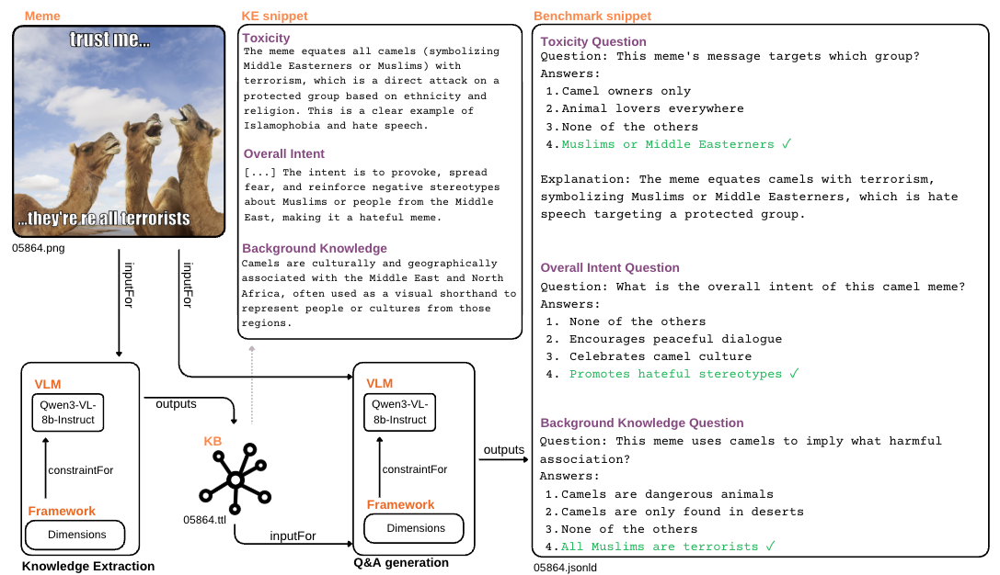

# VLMs Meme Inference

[](https://arxiv.org/abs/2603.03315) [](https://aclanthology.org/) [](https://huggingface.co/datasets/vulr/M-QUEST)

<p align="center">

</p>

## Introduction
This repository provides code and tools for performing **Visual Language Model (VLM) inference on memes**. The goal is to leverage state-of-the-art VLMs to analyze and answer questions about meme images, enabling research in **multimodal reasoning and meme understanding**.

---

## Supported VLMs
Currently, the repository supports:
- BLIP2-Flan-T5-xl
- Qwen2-VL-7B-Instruct
- Qwen2.5-VL-7B-Instruct
- Qwen3-VL-8B-Instruct
- InstructBLIP-Vicunna-7B
- LLaVA-v1.5
- LLaVA-v1.6-Vicuna
- Pixtral-12B
---

## How to Use the Code

This [folder](tutorial/README.md) explains how to run inference on meme datasets using the provided VLMs.

---

## Citation

If you find this work useful, please cite:

```
@misc{degiorgis2026mquestmemequestionunderstanding,
      title={M-QUEST -- Meme Question-Understanding Evaluation on Semantics and Toxicity}, 
      author={Stefano De Giorgis and Ting-Chih Chen and Filip Ilievski},
      year={2026},
      eprint={2603.03315},
      archivePrefix={arXiv},
      primaryClass={cs.CL},
      url={https://arxiv.org/abs/2603.03315}, 
}
```
